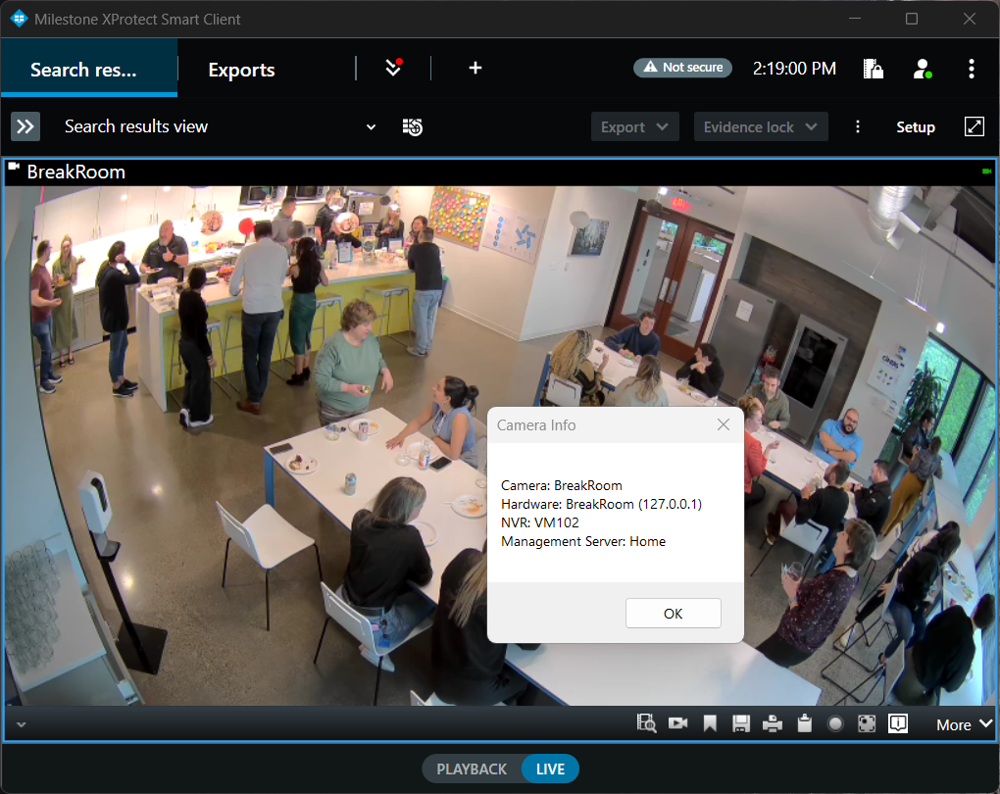

# MipItemInfoPlugin

MipItemInfoPlugin is a simple Milestone Integration Platform (MIP) plugin for the XProtect Smart Client. It adds a toolbar button that helps operators and administrators quickly identify where a camera lives in the XProtect configuration hierarchy (Management Server > Recording Server > Hardware). This is especially useful in large deployments with thousands of cameras and many servers where locating a camera's exact configuration location is time-consuming.

## Purpose

The plugin was created as a demonstration of how a relatively small MIP plugin can augment the Smart Client user experience and assist administrators with troubleshooting. When a security operator reports a camera issue, the plugin helps them provide the camera's location in the management/recording server topology quickly so diagnostics can begin faster.

## Features

- Adds a toolbar button in the Smart Client UI.
- When activated for a selected camera, shows the camera's location in the XProtect configuration hierarchy (Management Server -> Recording Server -> Hardware)
- Intended as a lightweight example / reference implementation for MIP plugin development

## Project structure (high level)

- `MipItemInfoPlugin/` - C# project containing the plugin source and resources
- `Setup/` - Wix setup project files for creating installers
- `output/` - Build output and packaged plugin

## Building

This project is a .NET/C# Visual Studio solution. Typical build steps (developer machine with Visual Studio):

1. Open `MipItemInfoPlugin.sln` in Visual Studio.
2. Build the `MipItemInfoPlugin` project in the desired configuration (Debug or Release).

Alternatively you can use the provided `build.ps1` PowerShell script to perform an automated build on Windows. Ensure you have the required SDKs and Visual Studio build tools installed.

## Installation / Packaging

Built plugin artifacts are placed under `output/MipItemInfoPlugin/` and `output/Setup/en-US/`. The package contains a `plugin.def` and the compiled plugin binaries. Use your usual deployment process for MIP plugins to copy the package to the XProtect Management Server and register it according to Milestone documentation, or use the MSI installer under `output/Setup`.

## License & Support

This plugin is provided as-is for demonstration and reference purposes. Milestone Systems A/S makes no guarantee of support, maintenance, or future upgrades. Use at your own risk. There is no commitment to update to newer MIP SDK versions, fix bugs, or provide compatibility guarantees with future releases of XProtect.

If you intend to use this plugin in production, review the source code, test thoroughly in a non-production environment, and adapt it to your environment and support processes.

## Contact / Contributions

This repository is provided as a sample. If you'd like to fork, adapt, or improve the plugin, you are free to do so under the terms of the license. Contributions are welcome via pull requests.
